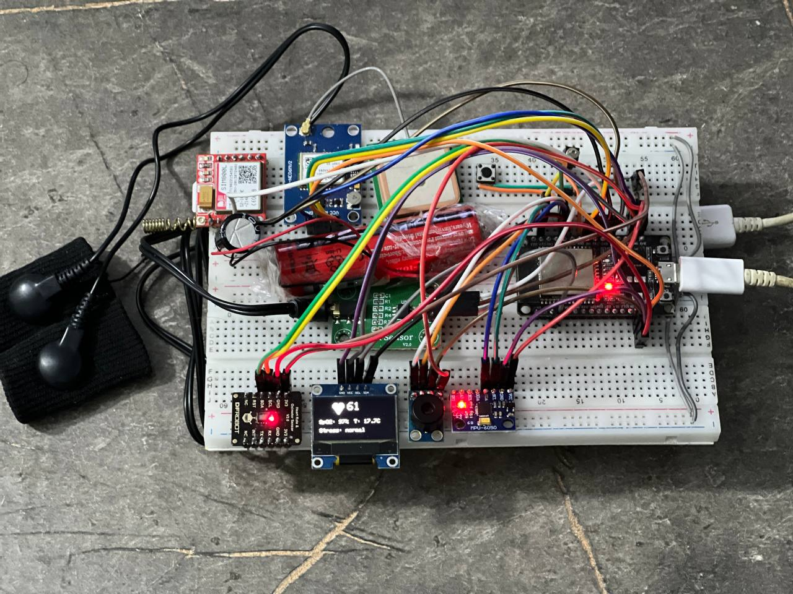
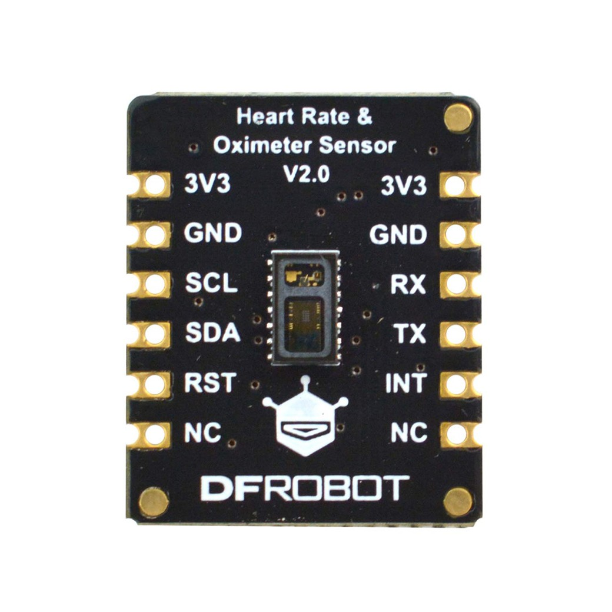
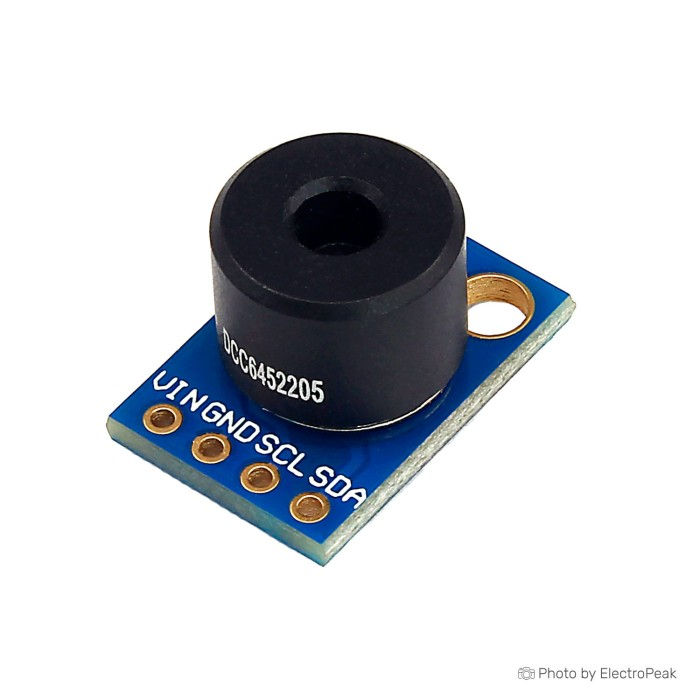

# ESP32 Wearable Health Monitoring System

An embedded wearable system designed to monitor vital signs, detect falls, and send emergency alerts in real time using ESP32 and multiple hardware modules.

---

## 🚀 Project Overview
This project implements a complete wearable health monitoring device capable of:
- Measuring heart rate and SpO2.
- Measuring skin temperature.
- Detecting falls using accelerometer data.
- Sending emergency SMS alerts with GPS location.
- Displaying real-time data on an OLED screen.
- Providing local vibration alerts and manual cancel button.

The system is designed for reliability, real-time operation, and low-level hardware interaction.

---

## 🧰 Hardware Components
- ESP32 Microcontroller  
- MAX30102 (Heart Rate & SpO2 Sensor)  
- MLX90614 (Temperature Sensor)  
- MPU6050 (Accelerometer / Fall Detection)  
- SIM800L GSM Module  
- GPS Module  
- OLED Display  
- Vibration Motor  
- Push Button  

---

## 💻 Software Features
- Embedded C/C++ firmware development.
- Peripheral driver integration.
- UART, I2C, and GPIO communication.
- Sensor validation and noise filtering.
- Fall detection algorithm with configurable thresholds.
- SMS alert generation and GPS location parsing.
- OLED user interface and system status display.
- Real-time system monitoring and error handling.

---

## 🧪 System Architecture
The system continuously reads sensor data, validates measurements, evaluates emergency conditions, and triggers alerts when thresholds are exceeded.

---
## 📦 Required Libraries
The following third-party libraries are required to build this project (not included in this repository):

- Adafruit BusIO  
- Adafruit GFX Library  
- Adafruit MLX90614  
- Adafruit MPU6050  
- Adafruit SSD1306  
- Adafruit Unified Sensor  
- ArduinoJson  
- DFRobot Blood Oxygen Sensor  
- TinyGPSPlus  
- TinyGSM  
- U8g2 for Adafruit GFX  

> Install these libraries using PlatformIO or Arduino Library Manager.
---
## ⚠️ Notes
- Third-party libraries are not included to respect licensing and repository size.
- Only custom application logic and integration code are provided.
---
## 📸 System Images

### 🔧 Hardware Setup

### 🧩 Software Architecture

### 📡 Sensors & Modules

